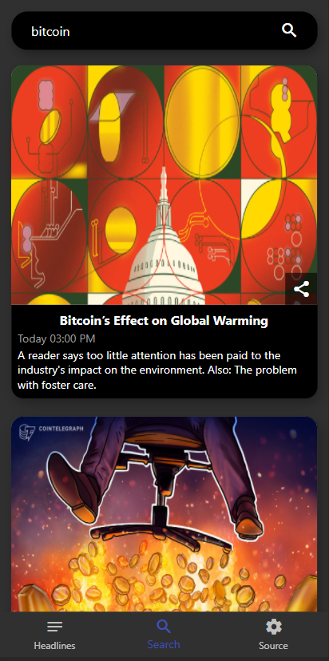

# News Bulletin

Read latest news and search articles.

## Installation

To run the app in your android or ios device, run the following command.

```
$ flutter pub get
$ flutter run
```

## Images

#### Light theme

<div>


</div>

#### Dark theme

<div>





</div>


